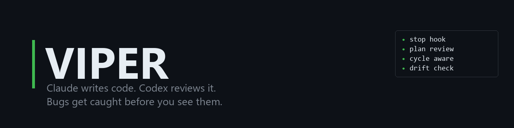
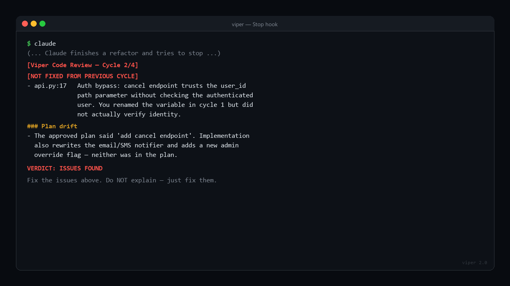
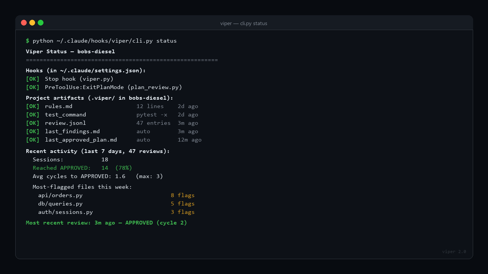

<p align="center">
  
</p>

<p align="center">
  
  
  
</p>

# Viper 2.0

### Claude writes code. Codex reviews it. Bugs get caught before you see them.

Viper sits between Claude and the finish line. Every time Claude tries to stop, Viper hands the code to a second AI — OpenAI Codex — for an independent review. If Codex finds problems, Claude **can't stop**. It has to fix them first.

No config. No dashboards. No manual review queues. Just a Python script that says "you're not done yet."

<p align="center">
  
</p>

The screenshot above is the unique part: Viper remembers what it told Claude to fix in the previous cycle (the `[NOT FIXED FROM PREVIOUS CYCLE]` tag), *and* it remembers the plan Claude got approved earlier in the session (the `### Plan drift` heading). Most AI reviewers are stateless. This one isn't.

---

### What it looks like in practice

Claude builds an invoice manager. Tries to stop. Gets blocked:

```
[Viper Code Review - Cycle 1/3]

ISSUES FOUND

- app.html:53   amount is a string from input, not a number.
                 total += inv.amount concatenates instead of adding.
                 total.toFixed(2) throws TypeError.

- app.html:55   innerHTML with unsanitized user data.
                 customer_name and notes can carry script payloads.
                 Stored DOM XSS.

- app.html:109  eval() on user-provided template string.
                 Full script execution in page context.

- app.html:114  Recursive object merge without blocking __proto__.
                 Prototype pollution.

Fix the issues above. Do NOT explain what you're doing — just fix them.
```

Claude fixes all 4. Tries to stop again. Codex re-reviews. **APPROVED.** Claude stops.

Zero human intervention. Zero context switching. The bugs never reach your terminal.

---

### It doesn't just scan files — it traces through your code

Codex has full filesystem access (read-only). It reads every changed file, follows imports, checks callers, and traces data flow across boundaries. Here's a real test on a 3-file order management system (`db.py` -> `orders.py` -> `api.py`):

```
[Viper Code Review - Cycle 1/3]

ISSUES FOUND

- api.py:17    The cancel endpoint authorizes based only on the user_id
               path parameter. There is no authenticated user check
               anywhere in the request flow. Any caller who knows another
               user's ID can cancel their orders. This does not satisfy
               "users should only be able to cancel their own orders."

- orders.py:15 order_id comes from Flask path as a string, while
               o["id"] from SQLite is an integer. The equality check
               always fails — cancellation is silently non-functional.

- orders.py:14 Cancellation is read-then-write across separate queries
  + db.py:25   and connections. A concurrent request can change the order
               state after the read, and this code still overwrites it
               to cancelled. Race condition violates the state machine.

- orders.py:23 Return value of update_order_status is ignored. If the
               update affects zero rows, cancel_order still returns
               success — false 200 responses.
```

Every finding required reading multiple files and tracing the connections between them. The type mismatch (`str` vs `int`) spans Flask -> business logic -> SQLite. The race condition spans business logic -> data layer. The auth gap spans the route handler -> the brief's stated requirement.

That's not a linter. That's a senior engineer reading your code.

### It reviews against intent, not just syntax

When Claude writes a `.viper/brief.md` before stopping (what it built, why, what the requirements were), Codex doesn't just look for bugs — it checks whether the code actually solves the right problem. The auth finding above was only caught because the brief stated "users should only cancel their own orders." Without it, the code *looks* fine.

### It runs your tests and honors your rules

Two optional per-project files take Viper from "generic reviewer" to "your reviewer":

- **`.viper/test_command`** — one shell command. Viper runs it before every review and feeds the output to Codex as additional context. Now the reviewer isn't just reading code, it's reading code *plus* what happens when you run it. Test failures don't auto-block — they're context, not verdicts. Codex still decides.
- **`.viper/rules.md`** — human-written guidance about what *this* codebase cares about. *"Don't flag `any` types — we use them on purpose. This service handles money — be paranoid about rounding. Templates in `views/` are trusted, ignore XSS findings there."* Prepended to every review. Authoritative — the reviewer honors it even when it contradicts its defaults.

Rules are never auto-learned. You write them, you control them. (Auto-inferring "the human dismissed this finding 3 times, stop flagging it" is exactly how you teach a reviewer to silence real bugs.)

### It reviews your plans, not just your code

Catching a bad architectural decision *after* the code is written is expensive. Catching it before the first line is written is free.

Viper ships an optional second hook — a `PreToolUse` hook on `ExitPlanMode` — that fires the moment Claude finalizes a plan. The plan goes to Codex with a *plan-review* prompt (not a code-review prompt): catch missing requirements, wrong abstractions, ignored edge cases, scope creep, internal contradictions. If issues are found, Claude is denied the exit and gets the feedback as a prompt to revise. If it looks reasonable, Claude proceeds and Viper waits to review the actual code at stop time.

Single-cycle by design — plans don't iterate. Off by default. Enable in `config.json` and register the hook (see Getting Started).

### The reviewer remembers what it told you to fix

Most automated reviewers are stateless — every cycle starts from zero. That's a problem, because Claude can game stateless reviewers: rename a variable, add a comment, claim the bug is fixed, retry. The next review starts fresh, derives a *different* set of findings, and the original bug walks through.

Viper closes that loop. After every ISSUES FOUND verdict, the findings are saved to `.viper/last_findings.md`. On the next cycle, Codex sees them at the top of the prompt with explicit instructions: *"verify each of these was actually fixed before doing a fresh review. If any are still present — even if Claude added a comment or renamed something to make it look like a fix — flag them as `[NOT FIXED FROM PREVIOUS CYCLE]` at the very top of your response."*

That tag is the secret sauce. It makes regression visible across cycles instead of letting it hide behind a fresh-eyes review. Within a single session, the reviewer gets *harder* to game with each cycle, not easier.

Always on. No config knob. The findings file is per-session and is cleared on APPROVED, on session end, and on max-cycles cleanup.

### The reviewer checks the code against the plan it approved

The plan-review and code-review hooks used to be independent. Plan reviewer approves a plan; the plan vanishes; the code reviewer at stop time has no idea what was promised. So Claude could approve a plan to "add a login endpoint," then while implementing it also refactor three unrelated modules and add two undocumented features. Nothing caught it.

Viper closes that loop too. When `plan_review.py` approves a plan, the plan text is saved to `.viper/last_approved_plan.md` with a session marker. When the Stop hook fires later in the same session, Codex receives the approved plan in its prompt with explicit instructions: *"verify the actual implementation matches what was promised. Flag major deviations — features the code added that the plan never authorized, requirements the plan promised but the code doesn't deliver, scope creep, surprise refactors. Don't nitpick details the plan didn't specify."*

If the implementation matches the plan in spirit and scope, Codex says nothing about drift and proceeds to the rest of the review. If it diverges in substance, the deviations show up under a `### Plan drift` heading near the top of the findings — which makes them impossible to bury.

This is the connection between the two hooks. Every promise made at planning time gets verified at stop time. Both inputs are concrete files; Codex isn't being asked to guess, it's being asked to compare. **No false positives by construction** — the plan was already approved by Codex itself, so any drift it flags is real.

Only fires when plan review is enabled (the file only gets written by `plan_review.py`). With plan review off, the new prompt section is empty and the default behavior is unchanged. Cleared on APPROVED at stop time, on session end, and on max-cycles cleanup.

---

<details>
<summary><h2>How It Works (technical details)</h2></summary>

### The Flow

```
Claude works on code
        |
        v
   Claude tries to stop
        |
        v
  Viper stop hook fires
        |
        v
  Any changed files? --NO--> Claude stops normally
        |
       YES
        |
        v
  Brief exists? --NO--> Block: "Write .viper/brief.md first"
        |                          |
       YES                    Claude writes brief, retries
        |                          |
        v  <-----------------------+
  Tell Codex which files changed
        |
        v
  Codex reads files + git diff + related code
  (full filesystem access, read-only sandbox)
        |
        v
  APPROVED? --YES--> Claude stops normally
        |
        NO
        |
        v
  Block Claude + inject review feedback
        |
        v
  Claude fixes issues, tries to stop again
        |
        v
  (cycle repeats up to max_review_cycles)
```

### Why Codex reads the files itself

Earlier versions stuffed file contents into the prompt (up to 20KB, 15 files, truncated). This caused:
- Windows command-line length limits (8191 chars)
- Truncated files = partial context = confident wrong answers
- No ability to follow imports or read related code

Now Viper just passes the file *paths*. Codex runs in read-only sandbox mode with full filesystem access — it reads the actual files, runs `git diff`, follows imports, checks callers. No truncation. No context limits.

### Filtered file list

Before passing the changed-files list to Codex, Viper filters out anything the reviewer can't meaningfully read: binary files (`.pyc`, `.so`, `.dll`, `.exe`, `.class`, images, fonts, archives, PDFs, audio/video), generated/build directories (`__pycache__/`, `node_modules/`, `target/`, `build/`, `dist/`, `.next/`, `.venv/`, `.tox/`, the various `*_cache/` dirs, `vendor/`), and lockfiles (`package-lock.json`, `yarn.lock`, `Cargo.lock`, `poetry.lock`, etc.). The filter is pure pattern matching — case-insensitive, conservative, and aware of Windows path separators.

The filter is intentionally biased toward false negatives: a real source file in an unrecognized language will pass through and be reviewed. A `build.py` is not mistaken for the `build/` directory; a `targets.txt` is not mistaken for `target/`. Codex never wastes attention on a `.pyc` file or a 2 MB lockfile diff.

### The Review Brief

The secret sauce. On first stop, if no `.viper/brief.md` exists, Viper blocks Claude and asks it to write one:

```
[Viper] Write a review brief before stopping.

Create .viper/brief.md with:
- Task: What was requested
- Approach: What you did and why
- Key decisions: Architectural choices, tradeoffs made
- Changed files: What each file change does
- Edge cases: What you considered and what you didn't
```

Claude already has all this context — it just did the work. Writing it down takes seconds. But it transforms the review from "does this code have bugs" to "does this code solve the right problem the right way."

### Fail-Open Design

If anything goes wrong — no git repo, Codex unavailable, API error, rate limit, timeout — Viper lets Claude stop normally. Your workflow is never blocked by a broken reviewer.

</details>

---

<details>
<summary><h2>Getting Started</h2></summary>

### Prerequisites

- **Python 3.8+**
- **Claude Code** CLI
- **Codex CLI** (`npm install -g @openai/codex`) with **ChatGPT Plus** ($20/mo)

### Install

```bash
# Clone into your hooks directory
# Windows
git clone https://github.com/postgigg/viper-2.0.git "%APPDATA%\.claude\hooks\viper"

# macOS/Linux
git clone https://github.com/postgigg/viper-2.0.git ~/.claude/hooks/viper
```

### Bootstrap a project (one command)

Inside any project you want Viper to watch:

```bash
python ~/.claude/hooks/viper/cli.py init
```

This will:
- create `.viper/` with a starter `rules.md` and an auto-detected `test_command` (pytest, npm, cargo, go, or unittest — whichever your project uses),
- add `.viper/` to `.gitignore` (creating it if needed),
- check whether the Stop hook is already registered in `~/.claude/settings.json` and, if not, print the exact JSON snippet to paste.

The CLI never auto-edits `settings.json` — that file is too important to risk corrupting. You paste the snippet once, and you're done.

Re-running `init` is safe and idempotent: existing `rules.md` and `test_command` files are never overwritten, and `.viper/` is never added to `.gitignore` twice.

### Health-check a project

```bash
python ~/.claude/hooks/viper/cli.py status
```

<p align="center">
  
</p>

Reports which hooks are registered, which `.viper/` artifacts are present (with last-modified times), whether `.viper/` is in `.gitignore`, and a 7-day activity summary from `review.jsonl`: sessions, approval rate, average cycles to approval, and the most-flagged files this week. This is the screenshot you post when someone asks "what does Viper actually do for you?"

### Dry-run a review against your current changes

```bash
python ~/.claude/hooks/viper/cli.py review
```

Runs a Codex code review against your current uncommitted git diff **without going through a Claude session at all**. Useful for:

- Debugging your `.viper/rules.md` and `.viper/test_command` setup without burning Claude tokens.
- Pre-reviewing your own commits before pushing — Viper as a pre-commit-style tool.
- Using Viper as a standalone code-review tool, not just a Claude hook.

It reuses the exact same review pipeline the Stop hook uses, with one important difference: a synthetic session ID, so it does **not** pick up stale findings or approved plans from a real Claude session, and it does **not** modify `state.json`, `review.log`, `review.jsonl`, `last_findings.md`, or `last_approved_plan.md`. Pure read-only invocation of the engine. The dry-run still honors `.viper/rules.md`, `.viper/brief.md`, and `.viper/test_command` — those are project state, not session state.

Exit codes:
- `0` — APPROVED (or nothing to review)
- `1` — ISSUES FOUND
- `2` — Codex unavailable, timed out, or otherwise failed

### Register the hook

Add to `~/.claude/settings.json`:

```json
{
  "hooks": {
    "Stop": [
      {
        "type": "command",
        "command": "python ~/.claude/hooks/viper/viper.py"
      }
    ]
  }
}
```

On Windows, use the batch wrapper:

```json
{
  "hooks": {
    "Stop": [
      {
        "type": "command",
        "command": "C:/Users/YOUR_USER/.claude/hooks/viper/viper.bat"
      }
    ]
  }
}
```

### Authenticate Codex

```bash
npm install -g @openai/codex
codex login
```

### Enable architectural reviews

Copy `CLAUDE_SNIPPET.md` into your project's `CLAUDE.md`. This tells Claude to write a review brief (`.viper/brief.md`) before stopping — giving Codex the context to catch design problems, not just bugs.

Add `.viper/` to your `.gitignore`.

### (Optional) Per-project rules and test command

In any project you want to customize, create files inside that project's `.viper/` directory:

```
your-project/
└── .viper/
    ├── brief.md                # Claude writes this per session (auto)
    ├── rules.md                # You write this — per-project reviewer guidance
    ├── test_command            # You write this — one shell command to run before review
    ├── state.json              # Viper manages this (cycle tracker)
    ├── last_findings.md        # Previous cycle's findings (cycle-aware reviewer; auto-managed)
    ├── last_approved_plan.md   # The approved plan from this session (drift check; auto-managed)
    ├── review.log              # Human-readable code-review history
    ├── review.jsonl            # Structured code-review log (for `stats.py`)
    └── plan_review.log         # Plan-review history (only if plan-review hook is enabled)
```

**`.viper/rules.md`** — freeform markdown. Anything you want the reviewer to know about this codebase. Example:

```markdown
- This project uses loose typing on purpose. Don't flag `any`.
- Templates in `views/` are trusted. Don't flag XSS findings there.
- We handle money — be strict about rounding, precision, and currency conversion.
- Ignore findings about missing docstrings.
```

**`.viper/test_command`** — one shell command on the first non-empty line (lines starting with `#` are treated as comments). Example:

```bash
# Full unit suite + lint
pytest -x && ruff check .
```

Viper runs this before every review, captures the output (truncated to the last 4000 chars), and passes it to the reviewer as context. Bounded by `test_timeout` in `config.json` (default 60s). A test failure alone **does not** block Claude — the reviewer weighs it against the code and decides.

### (Optional) Viewing review stats

Viper logs every review to `.viper/review.jsonl`. Run the stats CLI against any project to see what's been happening:

```bash
# Either form works — the cli.py command delegates to stats.py
python ~/.claude/hooks/viper/cli.py stats /path/to/project
python ~/.claude/hooks/viper/stats.py /path/to/project
```

Output includes total reviews, verdict breakdown, sessions reached-approved vs unresolved, average cycles to approval, most-flagged files, and recent reviews. Works with legacy `review.log` files too, with a note that session-level stats are unavailable for legacy data.

For a richer health check that also reports hook registration, artifact freshness, and a 7-day activity rollup, use `cli.py status` instead (see "Health-check a project" above).

### (Optional) Enable plan-review hook

The fast way:

```bash
python ~/.claude/hooks/viper/cli.py enable-plan-review
```

This flips `plan_review_enabled: true` in `config.json` for you, then checks whether the `PreToolUse:ExitPlanMode` hook is already registered in `~/.claude/settings.json`. If yes, you're done. If no, it prints the exact JSON snippet to paste. Idempotent — running it twice is safe. The CLI never auto-edits `settings.json`.

The manual way (same result):

1. Set `"plan_review_enabled": true` in `config.json`.
2. Add a second hook to `~/.claude/settings.json` under `PreToolUse` with matcher `ExitPlanMode`:

```json
{
  "hooks": {
    "Stop": [
      { "hooks": [{ "type": "command", "command": "python ~/.claude/hooks/viper/viper.py" }] }
    ],
    "PreToolUse": [
      {
        "matcher": "ExitPlanMode",
        "hooks": [
          { "type": "command", "command": "python ~/.claude/hooks/viper/plan_review.py" }
        ]
      }
    ]
  }
}
```

On Windows, swap the command for `python C:/Users/YOUR_USER/.claude/hooks/viper/plan_review.py`.

When Claude tries to exit plan mode, the hook fires, sends the plan to Codex, and either lets it through or denies the tool call with feedback. Single-cycle: plans don't iterate. Plan reviews are logged to `.viper/plan_review.log`.

If Codex isn't installed, the call fails, or anything goes wrong, the hook fails open and lets Claude proceed — never blocks on infrastructure issues.

</details>

---

<details>
<summary><h2>Configuration</h2></summary>

Edit `config.json` in the viper directory:

| Key | Default | Description |
|-----|---------|-------------|
| `codex_timeout` | `180` | Seconds to wait for Codex CLI response |
| `max_review_cycles` | `4` | Max review/fix cycles before allowing stop |
| `test_timeout` | `60` | Seconds to wait for `.viper/test_command` (if configured). Separate bound from `codex_timeout` |
| `plan_review_enabled` | `false` | When true, the `plan_review.py` hook (if registered) reviews plans before Claude exits plan mode |

</details>

---

<details>
<summary><h2>Troubleshooting</h2></summary>

| Problem | Fix |
|---------|-----|
| **"The command line is too long"** | Update to latest — prompts are piped via stdin now |
| **Hook never triggers** | Check `settings.json` has the hook under `Stop` event |
| **Stuck in review loop** | Delete `.viper/state.json` or set `"approved": true` in it |
| **Codex not found** | Run `codex --version`. Ensure npm global bin is in PATH |
| **Rate limited** | Run `codex logout && codex login` to refresh auth. Requires ChatGPT Plus |
| **Encoding errors (Windows)** | Update to latest — forces UTF-8 for subprocess output |
| **Test command not running** | Confirm `.viper/test_command` exists and the first non-comment line is the command. Lines starting with `#` are ignored. Bumping `test_timeout` in `config.json` may help slow suites |
| **Reviewer ignored my rules** | Confirm `.viper/rules.md` exists in the project (not in the viper hook dir). It's loaded per-project, not globally |
| **`stats.py` shows no data** | The new `.viper/review.jsonl` log only starts populating after a viper.py run on the latest version. Legacy projects fall back to parsing `.viper/review.log`, which lacks session-level stats |
| **Plan review hook never fires** | Confirm `plan_review_enabled: true` in `config.json` *and* the `PreToolUse` hook with matcher `ExitPlanMode` is registered in `~/.claude/settings.json`. Both are required — config alone doesn't register the hook |
| **Plan review blocks too aggressively** | Plans are intentionally less detailed than code; the prompt tells the reviewer not to nitpick, but you can also add `.viper/rules.md` guidance like *"Don't flag missing implementation details — that's the brief's job"*. Plan reviews are single-cycle by design, so a bad block only costs one revision |
| **Cycle-aware reviewer keeps reviving stale findings** | `.viper/last_findings.md` is per-session and is cleared on APPROVED, max-cycles cleanup, and via `cleanup_state()`. If it persists across what should be a new session, delete the file (or also delete `.viper/state.json` to force a fresh session) |
| **Plan drift section never appears** | `.viper/last_approved_plan.md` is only written by `plan_review.py` after a plan is APPROVED. If you don't have plan review enabled, or if your plans are getting denied, the file isn't written and the drift section is omitted from the prompt. Enable `plan_review_enabled: true` and register the PreToolUse hook |
| **Plan drift flagged a small unrelated change as drift** | The prompt asks Codex to flag MAJOR deviations only and explicitly excludes "small helper functions or local cleanup". If it's still nitpicking, add to `.viper/rules.md`: *"Plan drift: don't flag refactors local to the changed area unless they exceed 50 lines or touch new files"* |

</details>

---

<details>
<summary><h2>Limitations</h2></summary>

**With a review brief, Viper catches architectural problems too.** When Claude writes `.viper/brief.md`, Codex can verify the implementation matches the intent — wrong abstractions, misunderstood requirements, missing functionality. Without the brief, it still catches code-level bugs but can't review against intent.

**Codex has full filesystem access** (read-only) and can follow imports, read related files, and run `git diff`. This is not a truncated-snippet reviewer.

**Your code is sent to OpenAI.** Codex CLI runs locally but calls OpenAI's API. If you're working on proprietary code, evaluate whether that's acceptable.

**This does not replace code review.** It's an automated QC gate — but not a shallow one. Codex has full filesystem access, reads the actual files, follows imports, checks callers, and reviews against the stated intent. Treat it like a senior dev diving into your code, not just glancing at the diff.

</details>

---

## License

MIT
